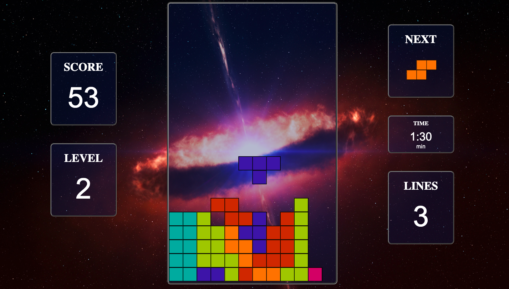
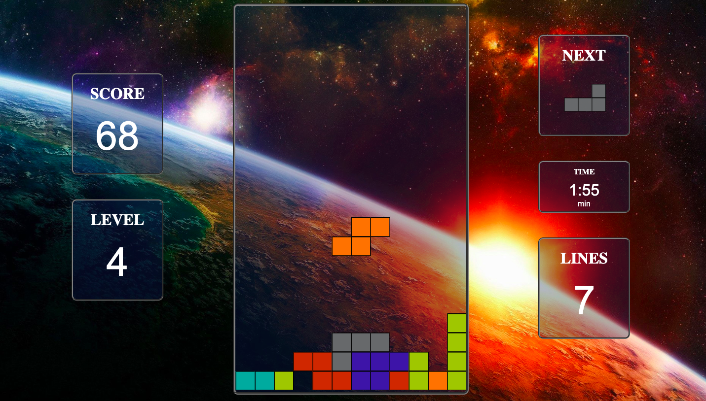
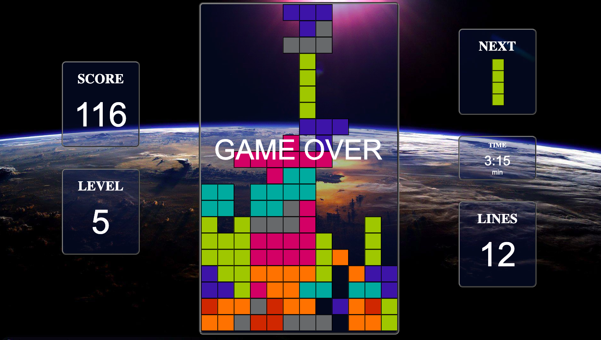

# JS | Tetris 5000
It is a tetris game inspired by Tetris 4000.

## Description

* Player needs to rotate the tetrominoes in order to fill holes and clear lines.
* To go to the next level a minimum number of lines need to be cleared. 
* Speed increases with levels.
* The objective is to clear as many lines as possible to avoid reaching the top.

## Game Overview
### Landing page

### Level 2

### Level 4

### Game Over

